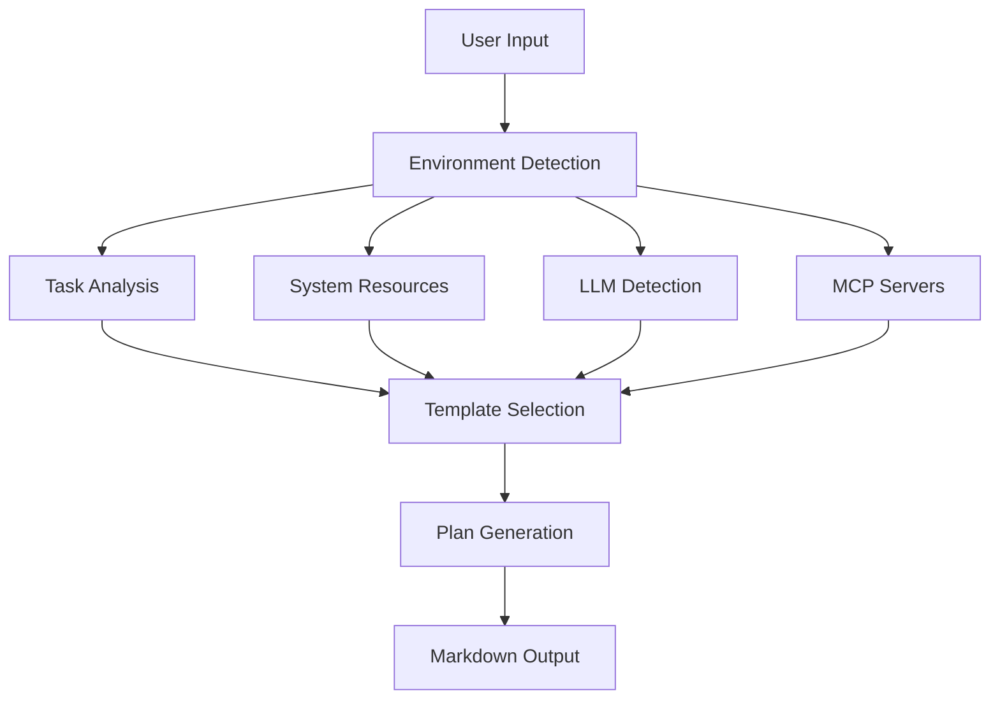
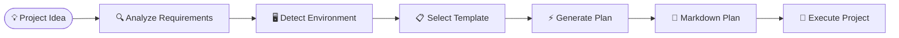

# 📚 Documentation & Visual Guide Strategy

## 📖 **Modular README Architecture**

### **Main Repository Structure:**
```
README.md                           # Main entry point & overview
├── 🚀 QUICK_START.md              # 5-minute setup guide
├── 📋 GUIDES/                     # Comprehensive guides directory
│   ├── README.md                  # Guide navigation hub
│   ├── INSTALLATION/              # Installation guides
│   │   ├── README.md              # Installation overview
│   │   ├── VS_CODE.md             # VS Code extension setup
│   │   ├── CURSOR.md              # Cursor extension setup
│   │   ├── WINDSURF.md            # Windsurf extension setup
│   │   ├── CLI_INSTALL.md         # Command line installation
│   │   └── DOCKER.md              # Docker setup
│   │
│   ├── USE_CASES/                 # Specific use case guides
│   │   ├── README.md              # Use cases overview
│   │   ├── SOFTWARE_DEV/          # Software development planning
│   │   │   ├── README.md          # Software dev overview
│   │   │   ├── WEB_APP.md         # Web application planning
│   │   │   ├── API_DEVELOPMENT.md # API planning guide
│   │   │   ├── MOBILE_APP.md      # Mobile app planning
│   │   │   └── DEVOPS.md          # DevOps pipeline planning
│   │   │
│   │   ├── CREATIVE/              # Creative project planning
│   │   │   ├── README.md          # Creative overview
│   │   │   ├── STORY_WRITING.md   # Novel/story planning
│   │   │   ├── CONTENT_CREATION.md # Content strategy planning
│   │   │   └── BRAND_DESIGN.md    # Brand development planning
│   │   │
│   │   ├── BUSINESS/              # Business planning
│   │   │   ├── README.md          # Business overview
│   │   │   ├── STARTUP_LAUNCH.md  # Startup planning
│   │   │   ├── MARKETING.md       # Marketing campaign planning
│   │   │   └── PROCESS_AUTOMATION.md # Business process planning
│   │   │
│   │   └── PERSONAL/              # Personal project planning
│   │       ├── README.md          # Personal overview
│   │       ├── LEARNING.md        # Skill development planning
│   │       ├── EVENTS.md          # Event planning guide
│   │       └── LIFESTYLE.md       # Lifestyle project planning
│   │
│   ├── ADVANCED/                  # Advanced features
│   │   ├── README.md              # Advanced overview
│   │   ├── ENVIRONMENT_DETECTION.md # Environment awareness
│   │   ├── CUSTOM_TEMPLATES.md    # Creating custom templates
│   │   ├── API_INTEGRATION.md     # API usage and integration
│   │   └── AUTOMATION.md          # Automation and workflows
│   │
│   └── TROUBLESHOOTING/          # Problem solving
│       ├── README.md             # Troubleshooting overview
│       ├── COMMON_ISSUES.md      # FAQ and common problems
│       ├── PERFORMANCE.md        # Performance optimization
│       └── SUPPORT.md            # Getting help and support
│
├── 🎨 ASSETS/                     # Visual assets
│   ├── images/                   # Screenshots and diagrams
│   ├── videos/                   # Demo videos and tutorials
│   ├── diagrams/                 # Architecture diagrams
│   └── examples/                 # Example plan outputs
│
└── 📊 EXAMPLES/                   # Live examples
    ├── README.md                 # Examples overview
    ├── generated_plans/          # Sample generated plans
    └── templates/                # Example templates
```

## 🎨 **Visual-Rich Documentation Strategy**

### **Main README.md Structure:**
```markdown
# 🎯 Opius Planner by Opius AI

<div align="center">
  
  <br>
  
  
  **Universal AI-Powered Planning Agent**
  
  *Transform any idea into a step-by-step plan that anyone can follow*
  
  
  
  
</div>

## 👋 **For Complete Beginners**

**Never used AI tools before? No problem!** This guide will help you create professional plans in minutes.

### 🤔 **What This Does (In Simple Terms)**
Think of this as having a super-smart assistant who can create detailed step-by-step plans for anything you want to do:

| 💭 **You Think** | 📋 **You Get** | 🤖 **AI Editors Can** |
|------------------|----------------|----------------------|
| "I want a website for my business" | **Complete 20-step guide** with what to do, what tools to use, and how long it takes | **Build your entire website** automatically using your plan |
| "I want to write a book" | **Chapter-by-chapter roadmap** with writing milestones and deadlines | **Help write chapters** based on your story outline |
| "I want to start a YouTube channel" | **Content strategy plan** with video ideas and growth tactics | **Generate scripts and thumbnails** from your content plan |

### 🎯 **Why This Matters for Agentic AI**
Modern AI editors (like Cursor, Windsurf, Claude) work best when they have detailed plans to follow. This tool creates **perfect plans** that AI can use to build amazing products for you.

## 🚀 **Get Started in 60 Seconds (No Tech Skills Needed)**

### **Easiest Way: VS Code Extension**
1. **Download VS Code** (free): [code.visualstudio.com](https://code.visualstudio.com)
2. **Install Opius Planner**: Search "Opius Planner" in Extensions
3. **Press Ctrl+Shift+P** and type "Opius Planner"
4. **Type your idea**: "Build a recipe sharing website"
5. **Get your plan**: Complete step-by-step guide appears!

### **No Install Way: Try Online**
Visit [planner.opius.ai](https://planner.opius.ai) and try it instantly in your browser.

### **Command Line (For Developers)**
```bash
# One command installs everything
curl -sSL https://install.opius.ai/planner | bash
opius-planner "Create a mobile fitness app"
```
```

### **Visual Documentation Components:**

**Architecture Diagrams:**


**Flow Charts for Use Cases:**


**Screenshots and Annotations:**
```markdown
### VS Code Integration Example


**Key Features Shown:**
1. **Command Palette** - Quick access with `Ctrl+Shift+P`
2. **Sidebar Panel** - Dedicated planning workspace  
3. **Live Preview** - Real-time plan preview
4. **Environment Status** - Shows detected RAM, LLM model, MCP servers
```

## 🎥 **Interactive Documentation**

### **Embedded Demos:**
```markdown
## Try It Live

<iframe src="https://planner.opius.ai/embed?demo=web-app" 
        width="100%" height="500px" frameborder="0">
</iframe>

*Interactive demo - try planning a web app without installing anything*
```

### **Step-by-Step Tutorials with GIFs:**
```markdown
## Tutorial: Your First Plan

### Step 1: Install Extension


### Step 2: Open Command Palette  


### Step 3: Enter Your Idea


### Step 4: Review Generated Plan

```

## 📊 **Visual Comparison Tables**

```markdown
## Installation Method Comparison

| Method | Setup Time | Requirements | Best For |
|--------|------------|--------------|----------|
| 🔌 VS Code Extension | 30 seconds | VS Code | Developers |
| 🐳 Docker | 10 seconds | Docker | Quick testing |
| 📦 pip install | 1 minute | Python | CLI users |
| 🌐 Web Interface | 0 seconds | Browser | Non-developers |

## Feature Matrix by Environment

| Feature | Basic | AI-Enhanced | High-Performance |
|---------|-------|-------------|------------------|
| Plan Generation | ✅ | ✅ | ✅ |
| Environment Detection | ✅ | ✅ | ✅ |
| AI Code Suggestions | ❌ | ✅ | ✅ |
| Parallel Processing | ❌ | ✅ | ✅ |
| MCP Integration | ❌ | ✅ | ✅ |
| Advanced Templates | ❌ | ✅ | ✅ |
```

## 🔄 **Cross-Reference Navigation**

Each README includes navigation blocks:

```markdown
---
## 🧭 Navigation

**Current:** Software Development Planning

**Related Guides:**
- ⬆️ [Main Guide Hub](../README.md)
- ➡️ [Creative Project Planning](../CREATIVE/README.md) 
- ➡️ [Business Planning](../BUSINESS/README.md)
- ⬇️ [Web App Development](WEB_APP.md)
- ⬇️ [API Development](API_DEVELOPMENT.md)

**Need Help?**
- 🆘 [Troubleshooting](../../TROUBLESHOOTING/README.md)
- 💬 [Community Support](../../SUPPORT.md)
- 📧 [Contact Us](mailto:support@opius.ai)
---
```

## 📝 **User Action Items in Generated Plans**

Generated plans now include clear action items for users:

### **Enhanced Plan Output Format:**
```markdown
# Universal Project Plan: Build E-commerce Website

## 👤 **Required Actions (You Need To Do These)**

### 🏪 **Accounts You'll Need to Create**
- [ ] **Domain Registrar Account** (GoDaddy, Namecheap, or Google Domains)
  - *Why*: To purchase your website domain name
  - *Cost*: $10-15/year
  - *Time*: 10 minutes
  - *Link*: [Domain Registration Guide](guides/domain-setup.md)

- [ ] **Web Hosting Account** (Netlify, Vercel, or DigitalOcean)
  - *Why*: To host your website files
  - *Cost*: Free tier available, $5-20/month for premium
  - *Time*: 15 minutes
  - *Link*: [Hosting Setup Guide](guides/hosting-setup.md)

- [ ] **Payment Gateway Account** (Stripe or PayPal)
  - *Why*: To accept payments from customers
  - *Cost*: Free to set up, 2.9% + 30¢ per transaction
  - *Time*: 30 minutes (including verification)
  - *Link*: [Payment Setup Guide](guides/payment-setup.md)

### 📋 **Permissions & Approvals Needed**
- [ ] **Business License** (if selling physical products)
  - *Why*: Legal requirement for business operations
  - *Where*: Your local city/county government
  - *Time*: 1-2 weeks processing
  - *Cost*: $50-200 depending on location

- [ ] **SSL Certificate** (usually included with hosting)
  - *Why*: Secure customer data and improve SEO
  - *How*: Auto-generated by most hosting providers
  - *Cost*: Free with most hosts

### 💳 **Budget Planning**
| Item | Cost | Required? | When Needed |
|------|------|-----------|-------------|
| Domain Name | $12/year | ✅ Required | Week 1 |
| Web Hosting | $0-20/month | ✅ Required | Week 1 |
| Payment Processing | 2.9% per sale | ✅ Required | Week 3 |
| SSL Certificate | $0-100/year | ✅ Required | Week 1 (usually free) |
| Business License | $50-200 | ⚠️ If selling products | Week 2 |

## 🤖 **What AI Can Do Automatically**
Once you complete the above actions, AI tools can handle:
- ✅ Website design and layout
- ✅ Product catalog creation
- ✅ Shopping cart functionality
- ✅ Order management system
- ✅ Customer email automation
- ✅ SEO optimization
- ✅ Mobile responsiveness

## 📞 **Need Help?**
- 🆘 [Troubleshooting Guide](guides/troubleshooting.md)
- 💬 [Community Forum](https://community.opius.ai)
- 📧 [Email Support](mailto:support@opius.ai)
- 🎥 [Video Tutorials](https://youtube.com/@opius-ai)
```

## 📖 **Layperson-Friendly Documentation Approach**

### **Documentation Writing Guidelines:**
1. **Assume Zero Technical Knowledge**
   - Explain every technical term
   - Provide screenshots for every step
   - Include "why" explanations, not just "how"

2. **Use Progressive Disclosure**
   - Start with simplest option
   - Offer advanced alternatives in expandable sections
   - Provide multiple paths (visual, command-line, web interface)

3. **Visual Learning Priority**
   - Every major concept has a diagram
   - Step-by-step screenshots with annotations
   - Video tutorials for complex processes
   - Before/after examples

4. **Immediate Success Feeling**
   - 30-second quick wins in every guide
   - Clear progress indicators
   - Celebration of completed steps
   - "What you accomplished" summaries

## 📱 **Content Creation Guidelines**

### **Writing Style**
- **Conversational tone**: "You'll create..." instead of "One creates..."
- **Active voice**: "Click the button" instead of "The button should be clicked"
- **Simple sentences**: Break complex ideas into digestible pieces
- **Encouraging language**: "Great job!" and "You're almost there!"

### **Visual Standards**
- **Consistent branding**: Opius AI colors and fonts throughout
- **High-quality screenshots**: 2x resolution for clarity
- **Annotated images**: Red arrows and callout boxes for clarity
- **Video specifications**: 1080p minimum, 30fps, with captions

### **Accessibility Standards**
- **Alt text** for all images
- **Keyboard navigation** instructions
- **Screen reader compatibility**
- **Color contrast** compliance (WCAG 2.1 AA)
- **Text-only alternatives** for all visual content
